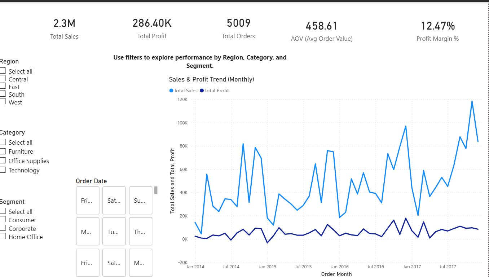
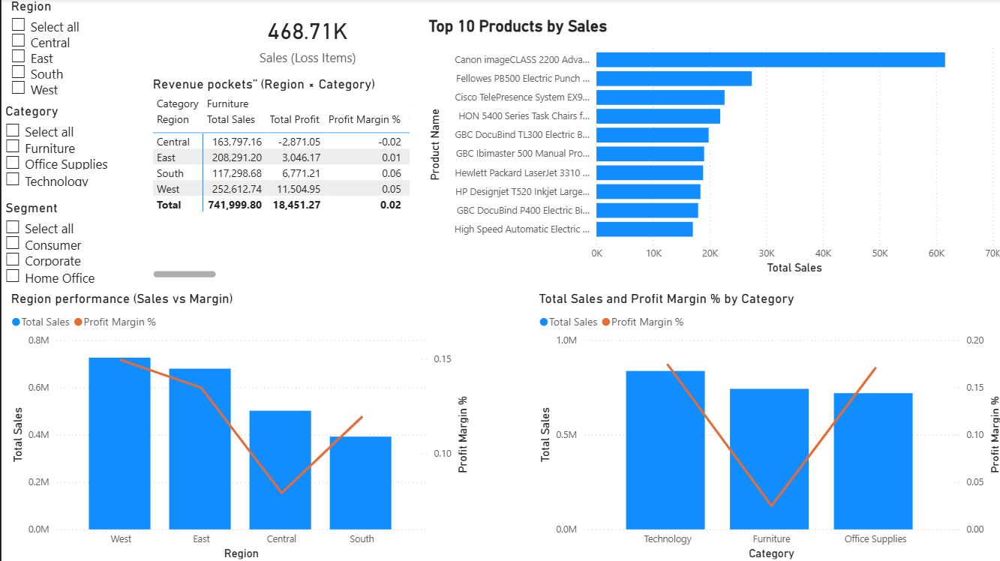

# FUTURE_DS_01 — Business Sales Performance Analytics (Superstore)

A client-ready sales performance dashboard built as part of the **Future Interns (Data Science & Analytics) Task 1**.  
The goal is to turn raw sales transactions into clear business answers and actionable recommendations using **Python (Google Colab)** for preparation/analysis and **Power BI** for dashboarding.

---

## Business Questions Answered

### 1) Which products generate the most revenue?
Using the **Top 10 Products by Sales** visual in the Product & Market page, we identify the highest-revenue products and compare their profitability signals (profit and margin) to avoid recommending “high sales but low value” items.

**Evidence:** See the *Top 10 Products by Sales* chart in the dashboard below.

### 2) How do sales change over time?
The Executive Overview page includes a **monthly Sales & Profit trend**. It shows overall growth with noticeable spikes, which is typical of business sales influenced by seasonality and occasional high-value orders.

**Evidence:** See the *Sales & Profit Trend (Monthly)* line chart below.

### 3) Which categories or regions are most profitable?
The Product & Market page compares **Sales vs Profit Margin** by both **Category** and **Region**, showing where revenue quality (margin) is strongest and where it is weakest. This avoids relying on sales volume alone.

**Evidence:** See *Category: Sales vs Profit Margin* and *Region: Sales vs Profit Margin* below.

### 4) Where should the business focus to grow faster?
The **Revenue Pockets (Region × Category)** matrix highlights the strongest combinations of market (region) and offering (category). This helps prioritize growth where sales are strong *and* margins are healthy, and flags areas where margin leaks need attention.

**Evidence:** See the *Revenue Pockets (Region × Category)* matrix below.

---

## Dashboard (Screenshots)

### Executive Overview

### Product & Market Performance

---

## Key Insights (Summary)
- **Sales and profit trend upward over time**, with month-to-month volatility driven by demand and large orders.
- **Technology and Office Supplies** generally provide healthier margins than **Furniture**, which tends to be margin-constrained.
- **Regional performance differs**: some regions deliver strong revenue with stronger profitability, while others show weaker margins (often linked to discount pressure).
- A meaningful share of revenue is associated with **loss-making items**, which is a clear opportunity for pricing/discount policy review.

---

## Recommendations 
- **Scale what works:** prioritize growth in region–category pockets that show both strong sales and healthy margins.
- **Fix margin leaks:** review pricing, discounting, and product mix where high sales produce weak margins (especially within Furniture).
- **Protect profitable winners:** ensure high-performing products remain in stock and are supported by sales/marketing.
- **Improve discount governance:** monitor high-discount transactions and introduce guardrails to prevent repeated loss-making sales.

---

## Data & Tools

### Dataset
- Kaggle Superstore dataset (Sample - Superstore.csv)  
  Source: https://www.kaggle.com/datasets/vivek468/superstore-dataset-final

### Tools Used
- **Python (Google Colab):** data understanding, feature engineering, validation checks, summary analysis
- **Power BI Desktop:** interactive dashboard, KPI measures, slicers, and visuals

---

## Repository Contents
- `reports/Executive_overview.png` — dashboard screenshot (Page 1)
- `reports/Product&Market.png` — dashboard screenshot (Page 2)
- `powerbi/` — Power BI dashboard file (`.pbix`) (if included in repo)
- `notebooks/` — analysis notebooks (if included)
- `data/` — exported analysis-ready CSVs 

---

## How to Use
1. Clone the repository.
2. Open the `.pbix` file in **Power BI Desktop**.
3. Use slicers (Region, Category, Segment, Date) to explore performance.
4. Review the Product & Market page for product leaders, profitability, and growth pockets.

---

## Author
**Hiwot** — Data Analyst Intern (Future Interns Task 1)
